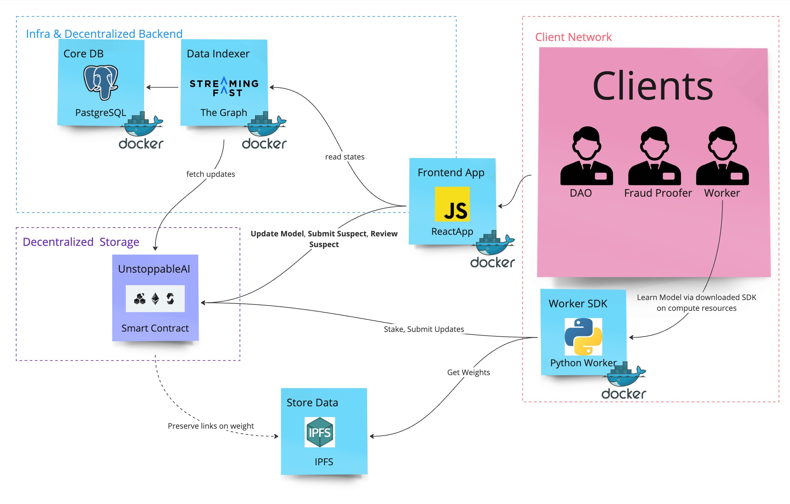

#  Unstoppable models 
(ETHPrague2024 project)

#AI #LLM #docker #streamlit #solidity #foundry #forge #ipfs #subgraph #DAO #decentralized #ethereum #zk
#byzantineTraining
#optimism #cardona #zircuit #linea #sepolia

# Demo
live: https://unstoppable-ai.why-nft.com/ or https://unstoppable-models.streamlit.app/

video: https://youtu.be/751XpV0xqEo

# Brief Description

We aim to create a public ML model training initiative (as a public good) where anyone can freely submit the next weight update for the model according to a fixed algorithm on a fixed dataset.

<!-- START doctoc generated TOC please keep comment here to allow auto update -->
<!-- DON'T EDIT THIS SECTION, INSTEAD RE-RUN doctoc TO UPDATE -->

- [Detailed Description](#detailed-description)
  - [Roles](#roles)
- [Realisation](#realisation)
  - [Scheme](#scheme)
  - [Off-chain parts](#off-chain-parts)
    - [Frontend](#frontend)
    - [Worker](#worker)
  - [Blockchain Related Parts](#blockchain-related-parts)
- [Deployments](#deployments)
  - [Cardona](#cardona)
  - [Optimism Sepolia](#optimism-sepolia)
  - [Sepolia](#sepolia)
  - [Zircuit](#zircuit)
  - [Linea](#linea)
- [Develop](#develop)
  - [Contract](#contract)
    - [Deploy](#deploy)
      - [Contract](#contract-1)
      - [Subgraph](#subgraph)

<!-- END doctoc generated TOC please keep comment here to allow auto update -->

# Detailed Description

The initial weights $\theta_0$ for the model $f$ are publicly initialized offchain.

A public dataset D is fixed offchain.

In each iteration $i$, all participants are informed about the specific data chunk (batch) $D_i$ to be fed into the model to update its weights.

All interested participants locally compute gradients $\nabla_{\theta_i} f := \frac { \partial f(D_i, \theta_i) } {\partial \theta_i}$.

They submit the hash of this computation to the chain (and optionally publish the actual value publicly).

The new weights are computed as $\theta_{i+1} = \theta_i - \nu \nabla_{\theta_i} f$. (or via similar optimization algorithm)

Every k steps, the updated weights are published offchain.

## Roles

Worker - Acquires a mutex (with a deposit) and attempts to perform a weight update step (or k steps). The Worker then publishes the updated weights on IPFS.

Validator - Token holders who resolve disputes. Validators receive rewards regardless of the outcome but are incentivized to act honestly to promote project growth.

Fraud-Proofer - Independently validates selected steps within a specific timeframe and can escalate disputes to the Validator if suspicious activity is detected (posting a deposit). If a correctly identified error is confirmed by the Validator, the Fraud-Proofer receives the Worker's stake.

# Realisation
## Scheme


## Off-chain parts
### Frontend
observes whole training process
```
cd research && \
python3 -m pip install -r requirements.txt && \
python3 -m streamlit run frontend-state-listener.py
```
(by default it listens to Cardona smart-contract instance)

### Worker
performs updates and syncs results with contract
```
cd research && \
python3 -m pip install -r requirements.txt && \
python3 worker.py
```

## Blockchain Related Parts

# Deployments

## Cardona
- contracts: [deployments](deployments/cardona.json)
- subgraph: https://api.studio.thegraph.com/query/77200/unstoppable-models/0.0.6

## Optimism Sepolia
- contracts: [deployments](deployments/optimismsepolia.json)
- subgraph: https://api.studio.thegraph.com/query/77200/unstoppable-models-optimismsep/0.0.2

## Sepolia
- contracts: [deployments](deployments/sepolia.json)
- subgraph: https://api.studio.thegraph.com/query/77200/unstoppable-models-sepolia/0.0.1

## Zircuit
- contracts: [zircuit.json](deployments%2Fzircuit.json)
- subgraph [self running] http://34.32.233.93:8000/subgraphs/name/unstoppable-models-zircuit

## Linea
- not enough balance =(

# Develop

## Contract

### Deploy

#### Contract
```bash
source .env && CONTRACTS_ENV_NAME=sepolia forge script --chain sepolia script/Deploy.s.sol:Deploy --rpc-url $SEPOLIA_RPC_URL --broadcast  -vvvv --legacy

source .env && CONTRACTS_ENV_NAME=cardona forge script script/Deploy.s.sol:Deploy --rpc-url https://rpc.cardona.zkevm-rpc.com --broadcast  -vvvv --legacy
source .env && CONTRACTS_ENV_NAME=linea forge script script/Deploy.s.sol:Deploy --rpc-url https://rpc.goerli.linea.build --broadcast  -vvvv --legacy
source .env && CONTRACTS_ENV_NAME=optimismsepolia forge script script/Deploy.s.sol:Deploy --rpc-url https://optimism-sepolia.drpc.org --broadcast  -vvvv --legacy
source .env && CONTRACTS_ENV_NAME=zircuit forge script script/Deploy.s.sol:Deploy --rpc-url https://zircuit1.p2pify.com --broadcast  -vvvv --legacy
```

or to Anvil
```
CONTRACTS_ENV_NAME=local forge script script/Deploy.s.sol:Deploy --fork-url http://localhost:8545 --broadcast  --legacy
```

questions:
- How DAO would be incentivised to act honestly? Like not to collude with the Worker to get the Worker's stake?
- Do you have a specific dataset in mind?

#### Subgraph
```bash
npm run import-config-networks && npm run create:local && npm run deploy:local
```
